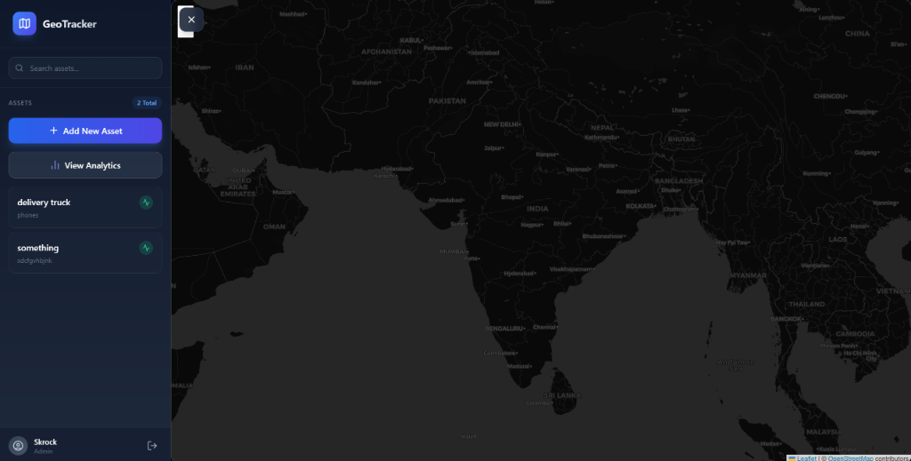

# 🌍 Geo-Based Asset Tracking System

A professional, full-stack MERN application designed for high-performance asset monitoring. Features real-time tracking, geo-spatial analytics, and a modern, dark-themed dashboard.

---

## 🚀 Key Features

- **📍 Real-Time Tracking**: Instant asset location updates powered by Socket.io.
- **📊 Advanced Analytics**: Aggregation-based insights into asset status, regional distribution, and activity trends.
- **🕒 Movement History**: Visualize the path of any asset with interactive polylines and hoverable timestamps.
- **🗺️ Geo-Spatial Queries**: Find assets near a location or within specific polygon zones using MongoDB's `2dsphere` indexes.
- **🔐 Secure Access**: Role-based authentication (Admin/User) with JWT and bcrypt protection.
- **💎 Premium UI**: A sleek, responsive dark-mode dashboard built with Framer Motion and Tailwind CSS.

---

## 🛠️ Tech Stack

### Frontend
- **Framework**: React 19 (Vite)
- **Styling**: Tailwind CSS
- **Maps**: Leaflet & React-Leaflet
- **Charts**: Recharts
- **Animations**: Framer Motion
- **Icons**: Lucide React
- **Real-time**: Socket.io-client

### Backend
- **Runtime**: Node.js & Express
- **Database**: MongoDB (Mongoose)
- **Geo-Spatial**: MongoDB 2dsphere indexes & aggregation pipelines
- **Auth**: JWT & Bcrypt.js
- **Real-time**: Socket.io

---

## ⚙️ Quick Start

### 1. Prerequisites
- Node.js (v18+)
- MongoDB (Local or Atlas)

### 2. Installation
```bash
# Clone the repository
git clone https://github.com/SKrock-1/Geo-Based-Asset-Tracking-System.git
cd Geo-Based-Asset-Tracking-System

# Install Server dependencies
cd server
npm install

# Install Client dependencies
cd ../client
npm install
```

### 3. Environment Setup
Create a `.env` file in the `server` directory based on `.env.example`:
```env
PORT=5000
MONGO_URI=your_mongodb_connection_string
JWT_SECRET=your_jwt_secret
```

### 4. Running the Project
```bash
# Run Server (from /server)
npm run dev

# Run Client (from /client)
npm run dev
```

---

## 🛣️ API Documentation

### Authentication
- `POST /api/auth/register` - Create a new account.
- `POST /api/auth/login` - Authenticate and receive a JWT.

### Assets
- `GET /api/assets` - List all assets.
- `POST /api/assets` - Create a new asset (Admin).
- `GET /api/assets/nearby` - Find assets within a radius.
- `POST /api/assets/within-zone` - Find assets in a polygon.
- `GET /api/assets/:id/history` - Get movement history for an asset.

### Analytics
- `GET /api/analytics/summary` - Get high-level system statistics.

---

## 📸 Screenshots


## 📄 License
Distributed under the ISC License. See `LICENSE` for more information.
